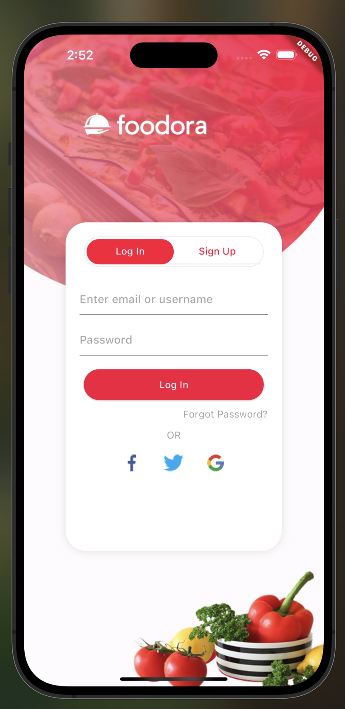
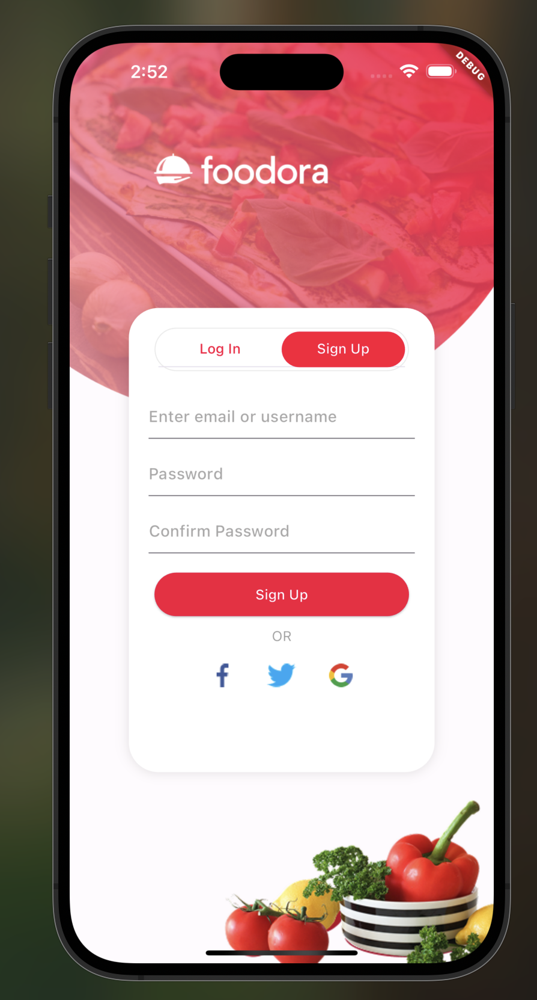
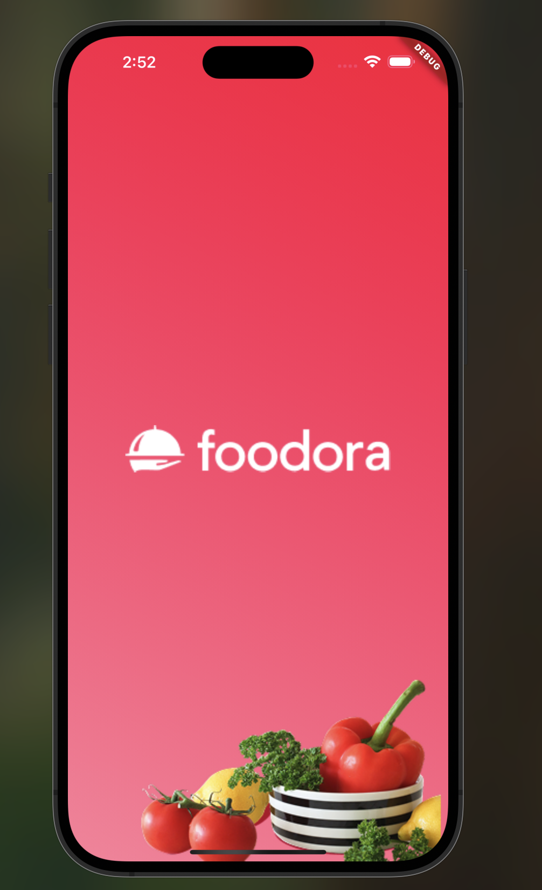

#  FOODORA App UI

A beautiful Flutter app UI for browsing and ordering food items.  
This project focuses on creating a clean, scrollable, and responsive restaurant-style user interface.

---

## 📱 Screenshots

### Login Screen  


### Signup Screen  


### Home Screen  


### Dashboard Screens  
  
  
  
  
  


---

##  Features

-  Drawer navigation with profile, orders, and settings  
-  Category selection for food items  
-  Scrollable vertical list and horizontal swiping (PageView)  
-  Food cards with rating, price, and add-to-cart dialog  
-  BottomSheet for food details or cart summary  
-  Minimal, clean, and modern UI  

---

##  Tech Stack

- Flutter (latest stable)
- Dart

---

## ▶️ Getting Started

1. Clone the repository:
   ```bash
   git clone https://github.com/your-username/foodora.git
2. Navigate to the project folder:
cd foodora
3. Install dependencies:
flutter pub get
4. Run the app:
flutter run

 Author

Manal 
GitHub: github.com/manaalq

