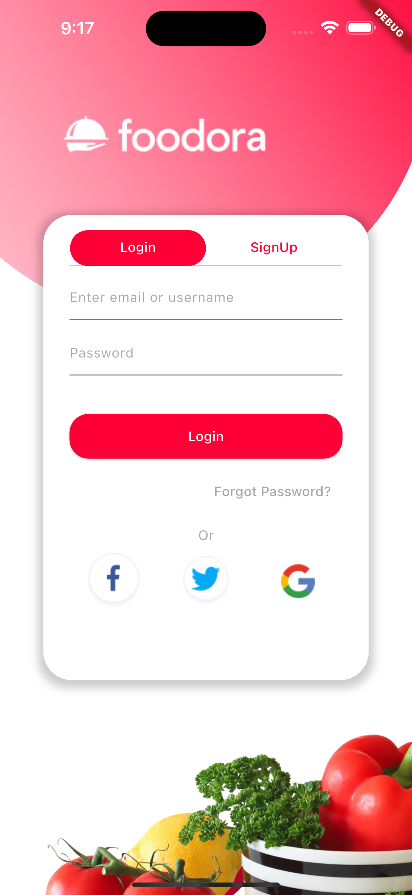
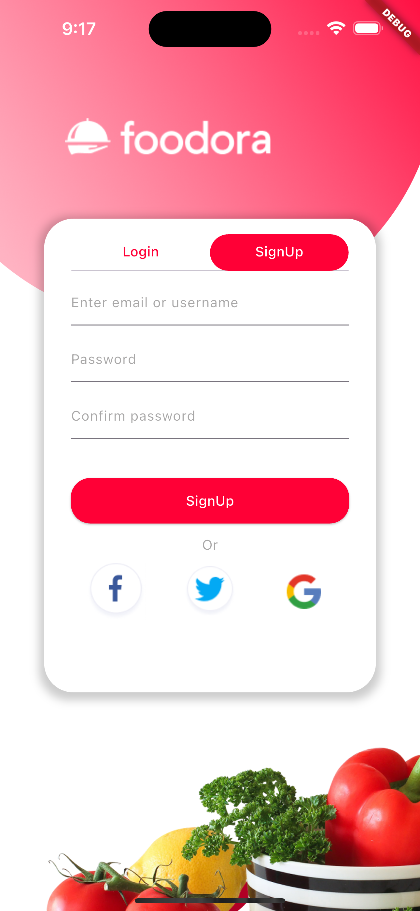
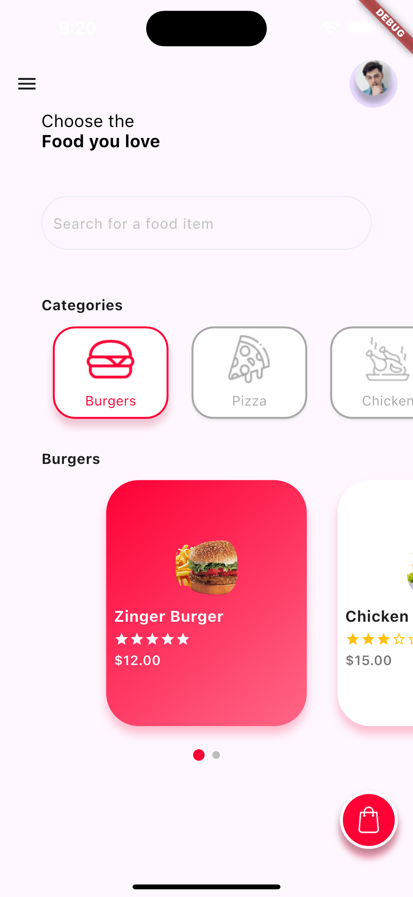

# Foodora App UI

A sleek Flutter-based food app UI featuring a smooth onboarding experience, intuitive authentication tabs, and a modern home screen with easy access to food categories and user options.

## Screenshots

### Onboarding Screen  


### Authentication Screen (Login & Signup Tabs)  


### Home Screen  


## Features

- **Onboarding Flow**  
  - Visually appealing welcome screens to introduce the app's features and value proposition.

- **Authentication with TabController**  
  - Seamless tab-based navigation between Login and Signup on the same screen.
  - Clean and modern form inputs with validation.

- **Home Screen with Drawer**  
  - A side drawer for easy navigation to settings, profile, and more.
  - User profile picture displayed on the top right for quick identity reference.

- **Food Categories & Items**  
  - Scrollable sections for browsing food categories and dishes.
  - Smooth UI transitions and structured layout for easy food discovery.

## Tech Stack

- **Flutter** (latest stable version)  
- **Dart**

## Installation

1. Clone the repository:
   ```bash
   git clone https://github.com/your-username/your-repo-name.git
2. Navigate to the project directory:
    ```bash
    cd your-repo-name
3. Install dependencies:
    ```bash
    flutter pub get
4. Run the app:
    ```bash
    flutter run
## How to use:
- Launch the app to view the onboarding screens.

- Use the Login or Signup tabs to authenticate.

- Once logged in, access the Home Screen with categorized food listings.

- Tap the drawer icon for navigation and settings.

- Click the foods and categories you want to pick.

## *Solaiman Al-Dokhail*

