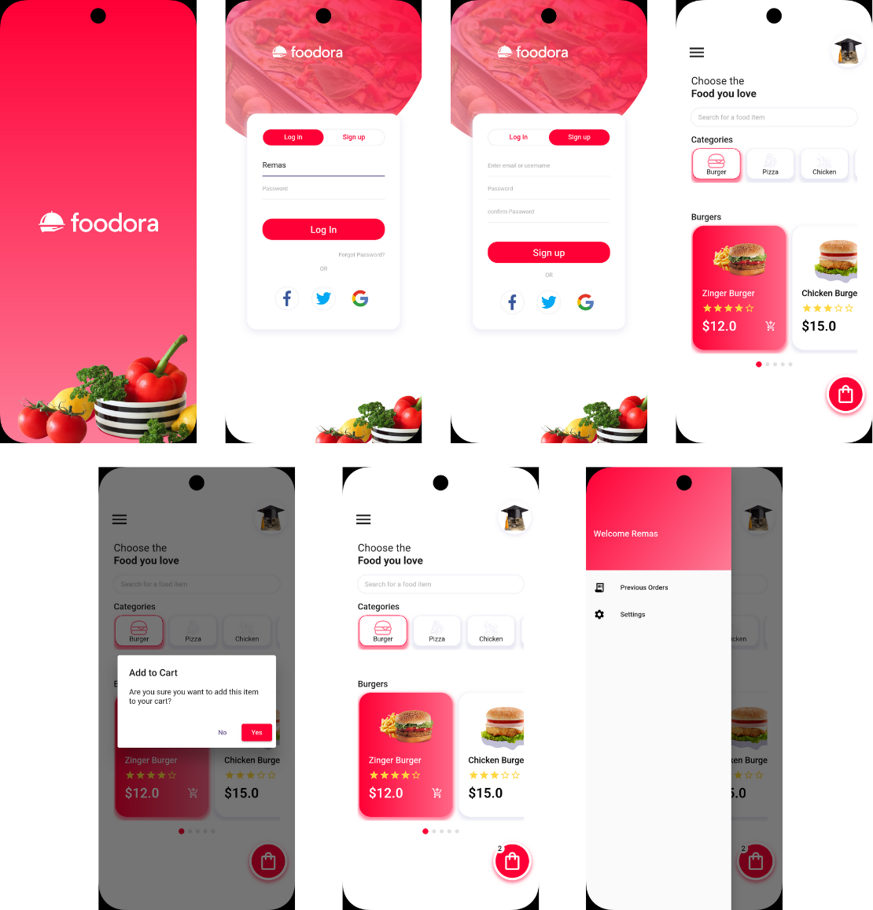

## Foodora App UI in Flutter 🍔
### Tuwaiq Academy Flutter Bootcamp

### 📘 Introduction

The goal of this project is to design and implement user interfaces for a Foodora style food delivery app using Flutter. The UI will be built by closely following a reference design provided via Figma [Foodora App Design](https://www.figma.com/design/2zd2h3XEZ7fsSkS3oeSOYn/Food-app---Authentication-(Community)?node-id=0-1&p=f&t=sXtJ8KxNe3voBCvy-0) to practice Flutter development and improve UI design implementation skills.. The focus is on accurately replicating the visual elements and layout to improve UI implementation skills and gain hands-on experience in translating modern food delivery app designs into responsive Flutter interfaces.

---
### 🔍 Project Preview




---
### ✨ Features

- **Splash Screen**: A loading screen that appears when the app is launched.

- **Login/Signup**: A screen that includes a TabBar to switch between the login and signup forms, allowing users to easily toggle between the two.

- **Home Screen**: The main screen of the app, which includes:
  - **Navigation Drawer**: A side menu containing options like "Previous Orders" and "Settings," with the user's name displayed at the top. This name is passed from the Login screen.
  - **Categories**: Displays food categories such as Burger, Pizza, Chicken, etc., using a horizontal ListView to allow users to scroll through the options.
  - **Burgers Section**: Lets users select burgers using a horizontally scrollable PageView for an interactive selection experience.
  - **Cart Functionality**: A cart button that adds items to the cart and increases the cart counter whenever an item is added.rs and Settings, with the user's name shown at the top. This name is passed from the Login screen.
---
### ⚙️ Tech Stack
- **Flutter**
- **Dart**

---
### 💻  Setup instructions 

 1. Clone the repository:

```
https://github.com/RemasNg1/Foodora-App-UI.git
```
2. Navigate to the project folder:

```
cd Foodora-App-UI/foodora_app
```

3. Install dependencies:
```
flutter pub get
```

 4. Run the app:
 ```
 flutter run 
 ```  

---
### 📂 Folder Structure 

```
lib
   ├── main.dart
   └── screens
       ├── login_signup_screen.dart
       ├── splash_screen.dart
       └── home_screen.dart
       
       
```


---
### 🖊️ Author
Remas Alnugaithan


