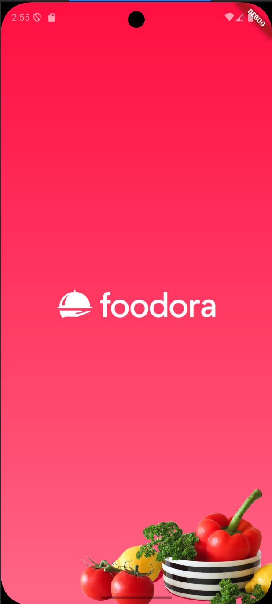
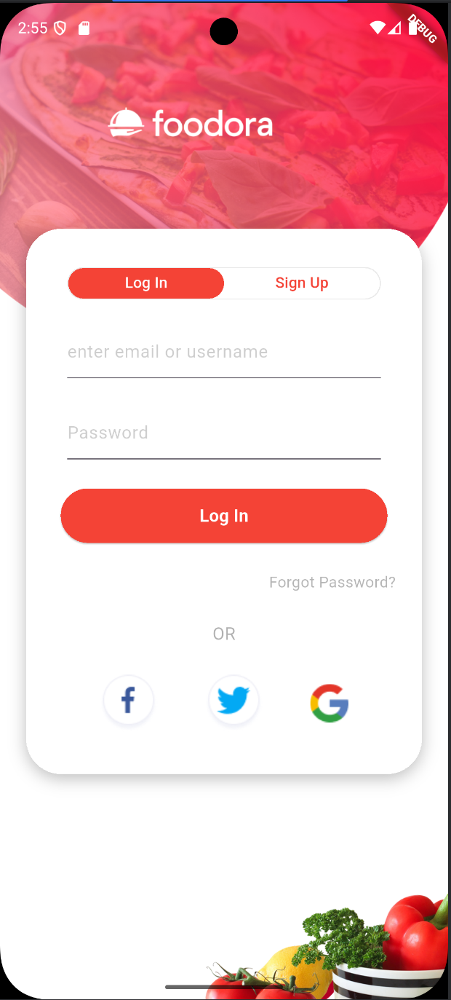
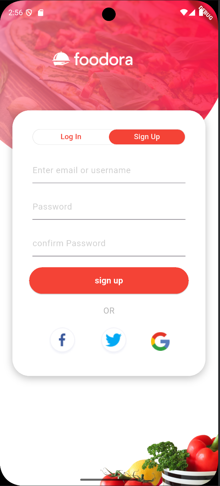
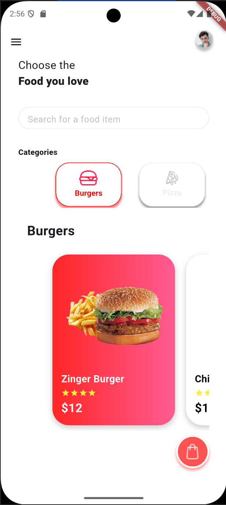

#  Foodora App UI Clone – Flutter Project


---

##  Screenshots

>

###  splash scren 


###  login screen


###  sign up screen


###  home screen


---

##  Demo Video


[ Watch Demo Video](foodra.mp4)

---

##  Project Objective

Replicate the **Foodora app UI** using Flutter to practice building real-world, production-style interfaces.  
The project focuses on:

- Clean UI practices.
- Interactive widget composition.
- Navigation between multiple screens and layouts.

---

##  Figma Design

- Design Source: [Foodora UI on Figma](https://www.figma.com/design/2zd2h3XEZ7fsSkS3oeSOYn/Food-app---Authentication--Community-?node-id=1-67&t=k3sT1UyYnFOCcy2r-0)

---

##  Features & Concepts

-  **Navigation**
  - Drawer navigation.
  - TabBar with category switching.

-  **Scrolling & Layout**
  - Vertical `ListView` for menu items.
  - `PageView` for horizontal featured food cards.


---

## 🛠 Tech Stack

- **Flutter**
- **Dart**


---

##  Project Structure

```
lib/
├── models/
├── screens/
│   ├── home_screen.dart
│   ├── food_detail_screen.dart
│   └── cart_screen.dart
├── widgets/
├── utils/
└── main.dart
```

---

##  Getting Started

1. Make sure Flutter SDK is installed.
2. Clone the repo:

```bash
git clone https://github.com/your-username/foodora-flutter-clone.git
cd foodora-flutter-clone
```

3. Install packages:

```bash
flutter pub get
```

4. Run the app:

```bash
flutter run
```

---

##  Author

- Name: *[Amr Noorwali]*


---

>  *"Food delivery apps should feel as smooth as melted cheese on a burger."*  
