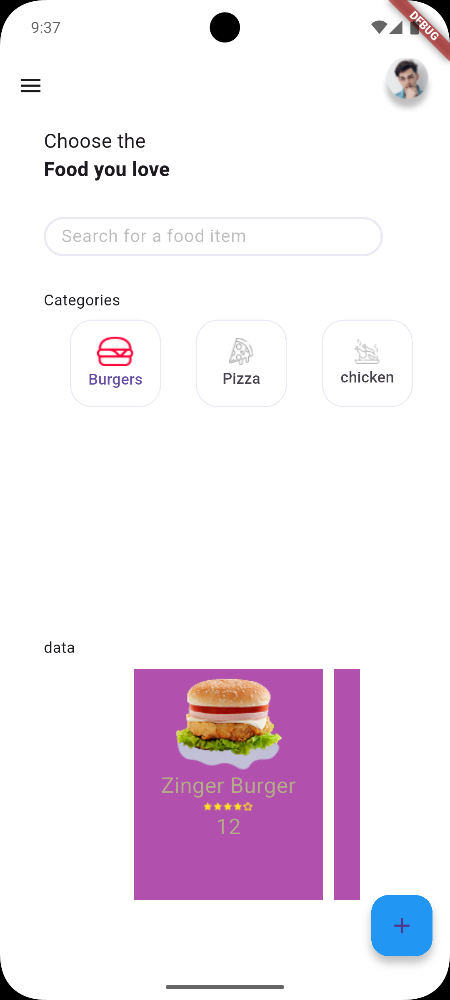

# foodora
interface displays the lists in an organized and attractive way for users.

#  🏗️Tech Stack
- Flutter (latest version)
- Dart

# ⬇️Installation
1. ⿻ Clone the repository:
git clone 

2. ➤ Navigate to the project folder:

3. ⬇ Install dependencies:
flutter pub get

4. ⚡︎ Run the app:
flutter run

# 🗃️Folder Structure
- lib/ ➯  conatin all files
- screens/ ➯ contain all screens 
- widgets/ ➯ widget we use it to biuld the UI 
- main.dart ➯ conatin the main fail

# 💡How to Use
- Open the app.
- Browse through available menu items.
- Add your favorite items to the cart or favorite.
- Search for items.

#  👨🏻‍🎨Author
- Lojain Maged